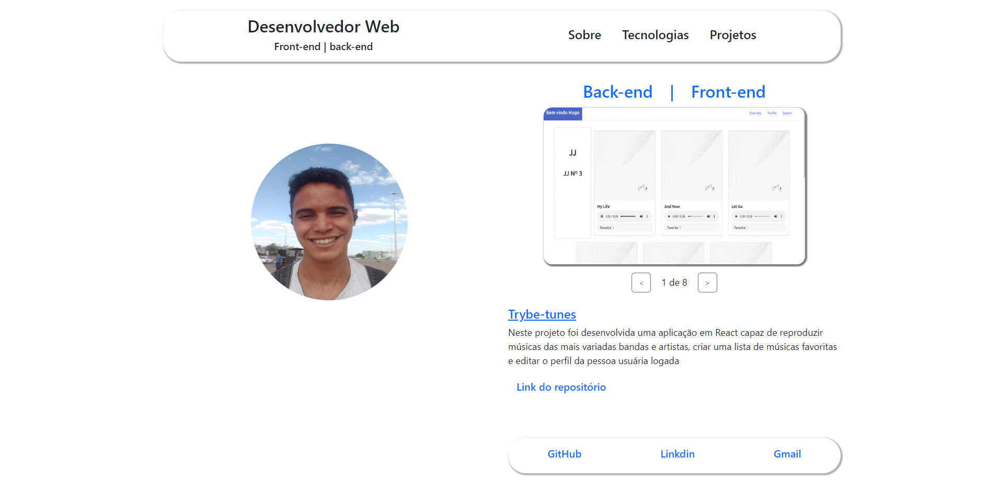

# Portfólio
 
# Contexto
 
A aplicação foi desenvolvida com o propósito de expor meus projetos realizados e minhas habilidades como desenvolvedor web, foi utilizado React e Bootstrap, utilizando o conceito de Single Page Application e com design responsivo.
Aplicação contém:
 
* Componente Header com menu para transitar entre as guias da aplicação;
* Guia de Sobre com uma descrição minha;
* Guia com tecnologias dominadas;
* Guia com todos os projetos realizados;
* Componente com meus contatos;

#

### Hugo de Sousa Silva
linkedin: https://www.linkedin.com/in/hugo-de-sousa-dev/

#



[Acesse o site aqui.](https://hugodesousa.github.io/)

## Tecnologias usadas

Front-end:
> Desenvolvido com HTML, CSS e JavaScript.
> React, Bootstrap
 
#
## Executando aplicação
 
* Para o site direto no navegador:
 
 ```
  https://hugodesousa.github.io/ 
 ```
* Para rodar em uma máquina local
 
 ```
   No terminal rodar os comandos:
 ```
 ```
   git clone git@github.com:Hugodesousa/Hugodesousa.github.io.git
 ```
 ```
   cd Hugodesousa.github.io.git

 ```
 ```
   npm install
 ```
 ```
   npm start
 ```
#
